<div align="center">
<table>
    <theader>
        <tr>
            <td style="width:25%;"></td>
            <td>
                <span style="font-weight:bold;">UNIVERSIDAD NACIONAL DE SAN AGUSTIN</span><br />
                <span style="font-weight:bold;">FACULTAD DE INGENIERÍA DE PRODUCCIÓN Y SERVICIOS</span><br />
                <span style="font-weight:bold;">DEPARTAMENTO ACADÉMICO DE INGENIERÍA DE SISTEMAS E INFORMÁTICA</span><br />
                <span style="font-weight:bold;">ESCUELA PROFESIONAL DE INGENIERÍA DE SISTEMAS</span>
            </td>            
        </tr>
    </theader>
    <tbody>
        <tr>
        <td colspan="2"><span style="font-weight:bold;">Proyecto web</span>: Desarrollo de una aplicación web para el manejo del proceso de recepción de un hotel</td>
        </tr>
        <tr>
        <td colspan="2"><span style="font-weight:bold;">Fecha</span>:  2023/08/05</td>
        </tr>
    </tbody>
</table>
</div>

<div align="center">
<span style="font-weight:bold;">PROYECTO WEB</span><br />
</div>


<table>
<theader>
<tr><th>INFORMACIÓN BÁSICA</th></tr>
</theader>
<tbody>
    <tr>
        <td>ASIGNATURA:</td><td>Programación Web 2</td>
    </tr>
    <tr>
        <td>SEMESTRE:</td><td>III</td>
    </tr>
    <tr>
        <td>ESTUDIANTE:</td><td>Juan José Condori Pinto (jcondoripin@unsa.edu.pe)</td>
    </tr>
    <tr>
        <td>FECHA INICIO:</td><td>01-Ago-2022</td><td>FECHA FIN:</td>
        <td>05-Ago-2022</td><td>DURACIÓN:</td><td>04 horas</td>
    </tr>
</tdbody>
</table>

#   WebApp con Django

[![License][license]][license-file]
[![Downloads][downloads]][releases]
[![Last Commit][last-commit]][releases]

[![Debian][Debian]][debian-site]
[![Git][Git]][git-site]
[![GitHub][GitHub]][github-site]
[![Vim][Vim]][vim-site]
[![Java][Java]][java-site]

##  Tipo de Sistema
    Se trata de una aplicación web construida con el framework Django 4, que permite la gestión básica del proceso de recepción de un hotel, desde la reserva de los huespedes hasta la salida de los mismos, la aplicación cuenta con dos vistas: para gerente y para recepcionista.

##  Requisitos del sistema
    Requerimientos funcionales

    - RQ01 : 
        - Titulo: Inicio y cierre de sesión
        - Descripción: El sistema debe permitir el inicio de sesión a partir de un email y una contraseña, así como el cierre de sesión.
        - RNF: 
            - RNF01
            - RNF03
            - RNF04
            - RNF05

    - RQ02 :
        - Titulo: Division de trabajo por roles
        - Descripción: El sistema debe permitir la division de responsabilidades por roles (gerente y recepcionista), designando permisos y tareas para cada uno
        - RNF:
            - RNF01
            - RNF03
            - RNF04
    
    - RQ03: 
        - Titulo: Gestion de habitaciones
        - Descripción: El sistema debe autorizar al gerente la gestión de habitaciones, tanto sea creación, edición, listado (también para los recepcionistas) y eliminación, tomando datos como número de habitación, piso, tipo, precio por noche, tamaño, imagen (en caso posea) y contenido de la misma. 
        - RNF:
            - RNF01
            - RNF02
            - RNF03
            - RNF04
    
    - RQ04:
        - Titulo: Gestion de recepcionistas
        - Descripción: El sistema debe autorizar al gerente la gestión de los recepcionistas de su hotel, registro, remoción, edición y listado, sus datos serían nombres, apellidos, dni, telefono, turno, email y contraseña del usuario.
        - RNF:
            - RNF01
            - RNF03
            - RNF04

    - RQ05:
        - Titulo: Visualización de reportes
        - Descripción: El sistema debe mostrar al gerente datos reales del estado actual de su empresa, tanto sea número de recepcionistas, reservas, habitaciones, checkins por habitación, huespedes por nacionalidad y ventas semanales.
        - RNF: 
            - RNF02
            - RNF04
    
    - RQ06: 
        - Titulo: Gestion de reservas
        - Descripción: El sistema debe poder permitirle a los recepcionistas la generación de reservas, pidiendo datos del huesped (identificacion, nombres, apellidos, sexo, fecha de nacimiento, nacionalidad, región, telefono y RUC de empresa, en caso posea), además del número de habitación que se desea reservar y los datos de llegada.
        - RNF:
            - RNF01
            - RNF02
            - RNF03
            - RNF04
            - RNF05

    - RQ07:
        - Titulo: Gestión de huespedes
        - Descripción: El recepcionista debe poder manejar la información de los huespedes, poder editarla y borrarlo en caso sea necesario, además de generar los acompañantes que posea para su hospedaje.
        - RNF:
            - RNF01
            - RNF02
            - RNF03
            - RNF04
        
    - RQ08:
        - Titulo: Manejo de Checkins
        - Descripción: El recepcionista debe poder manejar el registro de checkins al momento de la llegada de los huespedes, estos se deberían de generar a partir de una reserva indicando los paxx (cantidad de acompañantes), fecha y en qué estado se encuentra (Activo - inactivo)
        - RNF:
            - RNF01
            - RNF03
            - RNF04
    
    - RQ09:
        - Titulo: Manejo de checkouts
        - Descripción: El recepcionista debe poder manejar el registro de checkouts al momento de que los huespedes se retiren del hotel o su hospedaja haya terminado, mostrando total calculada del titular
        - RNF:
            - RNF01
            - RNF03
            - RNF04
    
    - RQ10: 
        - Titulo: Manejo de recordatorios
        - Descripción: El sistema puede permitir el manejo de etiquetas de recordatorio para los usuarios (gerente y recepcionistas) en tanto sea necesario, contemplando un título y descripción.
        - RNF:
            - RNF03
            - RNF04

    
    Requerimientos no funcionales

    - RNF01 : 
        - Titulo: Seguridad de información
        - Descripcón: El sistema debe encapsular los datos tanto de usuarios como información sensible de la base de datos solo accesibles a partir de métodos de autenticación.
    - RNF02 : 
        - Titulo: Velocidad y tiempo de respuesta
        - Descripción: El sistema debe tener un tiempo de respuesta mínimo ante las solicitudes y manejo de eventos.
    - RNF03 : 
        - Titulo: Interfaz intuitiva
        - Descripcion: La interfaz debe ser amigable con el usuario y accesible a todo público, sin redundancia o contenido inutilizable.
    - RNF04 : 
        - Titulo: Disponibilidad continua
        - Descripcion: La plataforma debe estar disponible en todo momento para el usuario.
    - RNF05 : 
        - Titulo: Manejo de errores
        - Descripcion: El sistema debe tolerar y ser capaz de manejar los errores que se vayan produciendo por parte del mal manejo de datos y falta de autenticación.


##  Modelo de datos
    El modelo de datos esta conformado por las siguientes entidades.

    -   Administrador (usuario): Es el usuario autenticable de la base de datos, este posee dos roles (gerente y recepcionista), atraves del cual será posible el acceso al dashboard de la aplicación.

    -   Habitación: En esta entidad se almacena la información de las habitaciones generadas por el gerente, las reservas se generan en torno a estas entidades.

    -   Contenido: Esta entidad almacena la información de un contenido que posea una habitación, estas últimas pueden poseer más de un contenido: cama, televisión, escritorio, etc.

    -   Huesped: Esta representa al huesped que se hospedará en el hotel (titular), almacena datos básicos de la persona y puede poseer más de una reserva,

    -   Acompañante: Un huesped puede poseer más de un acompañante, a diferencia de un huesped en esta entidad se almacenan datos más reducidos de identificación.

    -   Reserva: Esta entidad es la base del proceso de recepción, almacena datos de la reserva que genera el recepcionista para un huesped, posee un estado dinámico a medida que continua el proceso de recepción.

    -   Checkin: Esta entidad sirve como registro para el momento en el que un huesped haya ingresado a su estadía o se encuentre dentro del hotel, cuando ocurre esto el estado de su reserva pasa a 'Registrado'.

    -   Checkout: Esta entidad sirve como registro para el momento en el que el huesped se retira del hotel, está enlazado a un solo checkin, al igual que este a una reserva.

    -   Remind: Esta entidad es independiente y contiene información sobre un recordatorio que el usuario desee generar (titulo y descripción), un usuario puede poseer más de un recordatorio.


##  Diccionario de datos

    En la construcción de software y en el diccionario de datos se tomará en cuenta el campo 'id' autogenerado de cada tabla como llave primaria.

| Administrador | | | | | |
| -- | -- | -- | -- | -- | -- |
| Atributo  | Tipo  | Nulo | Unico | Predeterminado | Descripción |
| email  | Cadena | No | Si | Ninguno | Email del usuario |
| nombres  | Cadena | No | No | Ninguno | Nombre del usuario |
| apellidos | Cadena | No | No | Ninguno | Apellidos del usuario |
| dni | Numerico | No | Si | Ninguno | DNI del usuario |
| telefono | Numerico | No | Si | Ninguno | Telefono del usuario |
| rol | Cadena | No | No | Recepcionista | Rol del usuario |
| turno | Cadena | Si | No | NULL | Turno del recepcionista |

Para el resto de tablas se consideran los campos created_at y updated_at como Date.

| Habitación | | | | | |
| -- | -- | -- | -- | -- | -- |
| Atributo  | Tipo  | Nulo | Unico | Predeterminado | Descripción |
| nro_habitacion  | Numerico | No | Si | Ninguno | Nro de habitación |
| nro_piso | Numerico | No | No | Ninguno | Nro de piso |
| tipo_habitacion | Cadena| No | No | Ninguno | Tipo de habitación |
| precio | Decimal | No | No | Ninguno | Precio por noche |
| estado | Cadena | No | No | Libre | Estado de habitación |
| tamanio | Decimal | Si | No | Ninguno | Tamaño de habitación |
| imagen | Image | Si | No | NULL | Imagen de habitación |

| Contenido | | | | | |
| -- | -- | -- | -- | -- | -- |
| Atributo  | Tipo  | Nulo | Unico | Predeterminado | Descripción |
| habitacion_id | Foraneo: Habitacion | No | No | Ninguno | Llave foránea de habitación |
| nombre | Cadena | No | No | Ninguno | Nombre de contenido |
| cantidad | Numerico | No | No | Ninguno | Cantidad del contenido |
| descripcion | Cadena | Si | No | NULL | Descripción del contenido |

| Huesped | | | | | |
| -- | -- | -- | -- | -- | -- |
| Atributo  | Tipo  | Nulo | Unico | Predeterminado | Descripción |
| tipo_identificacion | Cadena | No | No | Dni | Tipo de identificación del huesped (DNI - Carnet) |
| identificacion | Cadena | No | Si | Ninguno | Nro de identificacion |
| nombres | Cadena | No | No | Ninguno | Nombres de huesped |
| apellidos | Cadena | No | No | Ninguno | Apellidos de huesped |
| sexo | Cadena | No | No | Ninguno | Sexo de huesped |
| fecha_nacimiento | Date | Si | No | NULL | Fecha de nacimiento del huesped |
| nacionalidad | Cadena | No | No | Ninguno | Nacionalidad del huesped |
| region | Cadena | No | No | Ninguno | Región dependiendo nacionalidad |
| telefono | Numerico | Si | No | NULL | Telefono de huesped |
| hospedado | Boolean | No | No | False | Estado de huesped (hospedado o no) |
| ruc_empresa | Cadena | Si | No | NULL | Ruc en caso posea a una empresa |

| Acompanante | | | | | |
| -- | -- | -- | -- | -- | -- |
| Atributo  | Tipo  | Nulo | Unico | Predeterminado | Descripción |
| titular_id | Foraneo | No | No | Ninguno | ID del titular al que acompaña |
| nombres | Cadena | No | No | Ninguno | Nombres de acompañante |
| apellidos | Cadena | No | No | Ninguno | Apellidos de acompañante |
| sexo | Cadena | No | No | Ninguno | Sexo de acompañante |
| tipo_identificacion | Cadena | No | No | Ninguno | Tipo de identificacion (Dni - carnet) |
| identificacion | Cadena | No | Si | Ninguno | Nro de identificación |
| relacion | Cadena | No | No | Ninguno | Relación con titular |

| Reserva | | | | | |
| -- | -- | -- | -- | -- | -- |
| Atributo  | Tipo  | Nulo | Unico | Predeterminado | Descripción |
| recepcionista_id | Foraneo | No | No | Ninguno | Recepcionista quien creó la reserva |
| titular_id | Foraneo | Si | No | NULL | ID del titular a quien pertenece |
| cantidad_dias | Numerico | No | No | Ninguno | Cantidad de días de hospedaje |
| tipo_reserva | Cadena | No | No | presencial | (Trabajo futuro) Medio por el cual se generó la reserva (presencial o virtual) |
| razon_hospedaje | Cadena | No | No | Ninguno | Razón por la cual se hospeda |
| peticiones | Texto | Si | No | NULL | Peticiones que tenga el huesped |
| fecha_llegada | Date | No | No | Ninguno | Fecha de llegada del huesped |
| estado | Cadena | No | No | Pendiente | Estado de reserva, sea pendiente, registrado, cancelado, pasado o registrado |
| habitacion_id | Foraneo | No | No | Ninguno | Habitación que se reserva |

| Checkin | | | | | |
| -- | -- | -- | -- | -- | -- |
| Atributo  | Tipo  | Nulo | Unico | Predeterminado | Descripción |
| recepcionista_id | Foraneo | Si | No | NULL | Recepcionista quien lo generó |
| reserva_id | Foraneo 1-1 | No | Si | Ninguno | Reserva a la cual pertenece el checkin |
| fecha_entrada | DateTime | No | No | Ahora | Fecha de llegada para el huesped |
| estado | Cadena | No | No | Activo | Estado de checkin (activo - inactivo) |
| paxx | Numerico | No | No | 0 | Cantidad de acompañantes |

| Checkout | | | | | |
| -- | -- | -- | -- | -- | -- |
| Atributo  | Tipo  | Nulo | Unico | Predeterminado | Descripción |
| checkin_id | Foraneo 1-1 | Si | No | NULL | Recepcionista quien lo generó |
| fecha_salida | DateTime | No | No | Ahora | Fecha de cuando se retiró el huesped |
| descripcion_salida | Cadena | Si | No | NULL | Descripción de la salida del cliente (reseña) |
| tarifa | Decimal | No | No | Ninguno | Tarifa por cantidad de días y precio de habitación por noche |

| Remind | | | | | |
| -- | -- | -- | -- | -- | -- |
| Atributo  | Tipo  | Nulo | Unico | Predeterminado | Descripción |
| titulo | Cadena | No | No | Ninguno | Titulo de recordatorio |
| descripcion | Cadena | No | No | Ninguno | Descripción de recordatorio |
| usuario_id | Foraneo | No | No | Ninguno | Usuario al cual pertenece |


##  Diagrama Entidad-Relación

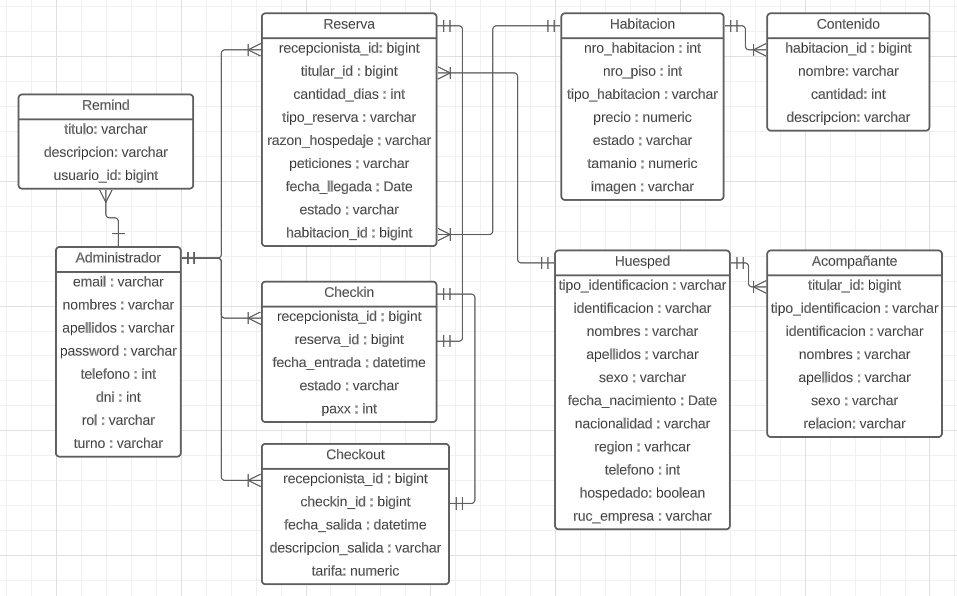

##  Administración con Django
    Se muestran los pasos realizados para crear el Proyecto, la aplicación, creacion de modelos, migraciones y habilitación del panel de administración en Django.
    
### Creación de proyecto

    La creación de un proyecto en django se realiza mediante el siguiente comando:


`django-admin startproject FastBooking .`

    Para la aplicación presentada, el proyecto se llama 'FastBooking' y consta de una aplicación 'Api'

`django-admin startapp Api`

    La aplicación de django no consta de una interfaz personalizada, sino la que nos proporciona por defecto el panel de administrador.

### Creación de modelos

    Los modelos estarán contenidos dentro de models.py, sin embargo, debido a que el usuario puede poseer dos roles ('gerente' y 'recepcionista'), se está optando por generar un usuario customizado de la siguiente manera:

```
class CustomUserManager(UserManager):
    def _create_user(self, email,   password, **extra_fields):
        if not email:
            raise ValueError("Debes proporcionar un email valido")
        email = self.normalize_email(email)
        user = self.model(email=email,**extra_fields)
        user.set_password(password)        user.save(using=self.db)

        return user

    def create_user(self, email=None, password=None, **extra_fields):
        extra_fields.setdefault('is_staff', False)
        extra_fields.setdefault('is_superuser', False)
        return self._create_user(email, password, **extra_fields)
    
    def create_superuser(self, email=None, password=None, **extra_fields):
        extra_fields.setdefault('is_staff', True)
        extra_fields.setdefault('is_superuser', True)
        extra_fields.setdefault('rol', 'gerente')
        return self._create_user(email, password, **extra_fields)
```

    La clase presentada es la base de un usuario autenticado, en ella se definen los métodos básicos de creación

```
class User(AbstractBaseUser, PermissionsMixin):
    roles = [
        ('recepcionista', 'recepcionista'),
        ('gerente', 'gerente')
    ]
    turnos = [
        ('mañana', 'mañana'),
        ('tarde', 'tarde'),
        ('noche', 'noche'),
        ('finesSemana', 'finesSemana'),
    ]

    email = models.EmailField(blank=True, default='', unique=True)
    nombres = models.CharField(max_length=255)
    apellidos = models.CharField(max_length=255)
    dni = models.PositiveIntegerField(unique=True)
    telefono = models.PositiveIntegerField(unique=True)
    rol = models.CharField(max_length=15, choices=roles, default='recepcionista')
    turno = models.CharField(max_length=15, choices=turnos)

    is_active = models.BooleanField(default=True)
    is_superuser = models.BooleanField(default=False)
    is_staff = models.BooleanField(default=False)

    date_joined = models.DateTimeField(default=timezone.now)
    last_login = models.DateTimeField(blank=True, null=True)

    objects = CustomUserManager()

    USERNAME_FIELD = 'email'
    EMAIL_FIELD = 'email'
    REQUIRED_FIELDS = ['nombres', 'apellidos', 'dni', 'telefono']
    
    class Meta:
        db_table = 'administradores'
        verbose_name = 'administrador'
        verbose_name_plural = 'administradores'
    
    def get_full_name(self):
        return self.nombres
    
    def get_short_name(self):
        return self.nombres or self.email.split('@')[0]
```

    La clase de usuario posee algunos campos adicionales, como rol, turno, telefono o dni, además de definir el atributo objects con el manager definido anteriormente

    
#### Clase habitacion:

```
class Habitacion(models.Model):

    estados = [
        ('Libre', 'Libre'),
        ('Ocupado', 'Ocupado'),
        ('Reservado', 'Reservado'),
        ('Limpieza', 'Limpieza'),
        ('No operativo', 'NoOperativo'),
    ]

    nro_habitacion = models.PositiveIntegerField(unique=True, null=False)
    nro_piso = models.PositiveSmallIntegerField(null=False)
    tipo_habitacion = models.CharField(null=False, max_length=30)
    precio = models.DecimalField(max_digits=6, decimal_places=2, null=False)
    estado = models.CharField(choices=estados, default='Libre', max_length=12)
    tamanio = models.DecimalField(max_digits=4, decimal_places=2)
    imagen = models.ImageField(upload_to='habitaciones', null=True)

    created_at = models.DateTimeField(auto_now_add=True, null=False)
    updatedat = models.DateTimeField(auto_now=True)
```

#### Clase contenido:

```
class Contenido(models.Model):
    habitacion = models.ForeignKey(Habitacion, on_delete=models.CASCADE, null=False)
    nombre = models.CharField(max_length=100, null=False)
    cantidad = models.PositiveIntegerField(default=1, null=False)
    descripcion = models.CharField(max_length=100, null=True)

    created_at = models.DateTimeField(auto_now_add=True, null=False)
    updated_at = models.DateTimeField(auto_now=True)
```

#### Clase Huesped:

```
class Huesped(models.Model):
    tipos_identificacion = [
        ('Dni', 'Dni'),
        ('Carnet_Extranjeria', "Carnet_Extranjeria")
    ]

    tipo_identificacion = models.CharField(max_length=20, choices=tipos_identificacion, default='Dni')
    identificacion = models.CharField(max_length=20, null=False, unique=True)

    nombres = models.CharField(max_length=50, null=False)
    apellidos = models.CharField(max_length=50, null=False)
    sexo = models.CharField(choices=[('Masculino', 'masculino'), ('Femenino', 'femenino')], null=False, max_length=9)
    fecha_nacimiento = models.DateField(auto_created=False)

    nacionalidad = models.CharField(max_length=20, null=False)
    region = models.CharField(max_length=30)
    telefono = models.PositiveIntegerField()

    hospedado = models.BooleanField(default=False)

    created_at = models.DateTimeField(auto_now_add=True, null=False)
    updated_at = models.DateTimeField(auto_now=True)

    # Opcional, si el huesped viaja por motivos de negocio
    ruc_empresa = models.CharField(null=True, max_length=11, blank=True)
```

#### Clase Acompanante:

```
class Acompanante(models.Model):
    titular = models.ForeignKey(Huesped, on_delete=models.CASCADE)
    nombres = models.CharField(max_length=50)
    apellidos = models.CharField(max_length=50)
    sexo = models.CharField(choices=[('Masculino', 'masculino'), ('Femenino', 'femenino')], null=False, max_length=9)

    tipo_identificacion = models.CharField(max_length=20, null=True)
    identificacion = models.CharField(max_length=20, null=True, unique=True)

    relacion = models.CharField(max_length=50, help_text="Relación con el titular")

    created_at = models.DateTimeField(auto_now_add=True, null=False)
    updated_at = models.DateTimeField(auto_now=True)
```

#### Clase Reserva:

```
class Reserva(models.Model):

    estados = [
        ('Pendiente', 'pendiente'), # Aún ho hay checkin
        ('Cancelado', 'cancelado'), 
        ('Pasado', 'pasado'),  # Se realizó el checkout
        ('Registrado', 'Registrado') # Cuando se realizó el checkin
    ]

    # Para saber cuál recepcionista lo realizó
    recepcionista = models.ForeignKey(User, on_delete=models.SET_NULL, name='recepcionista', null=True)

    titular = models.ForeignKey(Huesped, on_delete=models.CASCADE, null=False)
    cantidad_dias = models.PositiveIntegerField(null=False)
    tipo_reserva = models.CharField(choices=[('Presencial', 'presencial'), ('Virtual', 'virtual')], default='presencial', max_length=15)
    razon_hospedaje = models.CharField(max_length=50)
    peticiones = models.TextField(max_length=100, blank=True, null=True)
    fecha_llegada = models.DateField(null=False)
    estado = models.CharField(choices=estados, default='Pendiente', max_length=10)

    habitacion = models.ForeignKey(Habitacion, on_delete=models.CASCADE, null=False)

    created_at = models.DateTimeField(auto_now_add=True, null=False)
    updated_at = models.DateTimeField(auto_now=True)
```

#### Clase Checkin:

```
class Checkin(models.Model):

    estados = [
        ('Activo', 'activo'), # Checkin vigente
        ('Inactivo', 'inactivo') # Checkout realizado
    ]
    
    # Para saber cuál recepcionista lo realizó
    recepcionista = models.ForeignKey(User, on_delete=models.SET_NULL, name='recepcionista', null=True)

    reserva = models.OneToOneField(Reserva,on_delete=models.CASCADE)
    fecha_entrada = models.DateTimeField(auto_now_add=True, null=False)
    estado = models.CharField(choices=estados, default='Activo', max_length=8)

    paxx = models.PositiveIntegerField(default=0) # Número de acompañantes

    created_at = models.DateTimeField(auto_now_add=True, null=False)
    updated_at = models.DateTimeField(auto_now=True)
```

#### Clase Checkout:

```
class Checkout(models.Model):

    # Para saber cuál recepcionista lo realizó
    recepcionista = models.ForeignKey(User, on_delete=models.SET_NULL, name='recepcionista', null=True)

    checkin = models.OneToOneField(Checkin, on_delete=models.CASCADE)
    fecha_salida = models.DateTimeField(auto_now_add=True, null=False)
    descripcion_salida = models.CharField(blank=True, null=True, max_length=500)
    tarifa = models.DecimalField(decimal_places=2, max_digits=7, null=False)

    created_at = models.DateTimeField(auto_now_add=True, null=False)
    updated_at = models.DateTimeField(auto_now=True)
```

#### Clase Remind (recordatorio):

```
class Remind(models.Model):

    titulo = models.CharField(max_length=50, null=False)
    descripcion = models.CharField(max_length=255, null=False)
    usuario = models.ForeignKey(User, on_delete=models.CASCADE, null=False)

    created_at = models.DateTimeField(auto_now_add=True)
    updated_at = models.DateTimeField(auto_now=True)
```

    Note que cada clase contiene dos campos created_at y updated_at, estos no fueron detallados en el diccionario de datos debido a que son comunes para casi todas las tablas.

    Para migrar las tablas a la base de datos es necesario primero crear las migraciones y ejecutarlas a través de los comandos:

`python manage.py makemigrations`
`python manage.py migrate`

    Luego de ello debemos registrar un superusuario (gerente) para que este pueda generar los recepcionistas y gestionar sus cuentas

`python manage.py createsuperuser`

    Si los modelos se colocaron de forma correcta, para la creación del superusuario debería pedir email, nombres, apellidos, telefono, dni y contraseña.

    Una vez registrado debería registrarse al menos un modelo en el panel de administrador, en nuestro caso se optó solo por el manejo de usuarios, mientras que las demás tablas serán gestionadas en el dashboard.

```
from django.contrib import admin
from .models import User

admin.site.register(User)
```

    Una vez colocado, en el panel de administrador nos debería de aparecer algo parecido a esto:

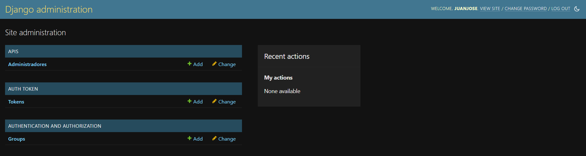


##  Vistas de front end

    El front end fue desarrollado en Angular v16 mediante el uso de componentes, rutas, guards, servicios e interfaces Typescript.

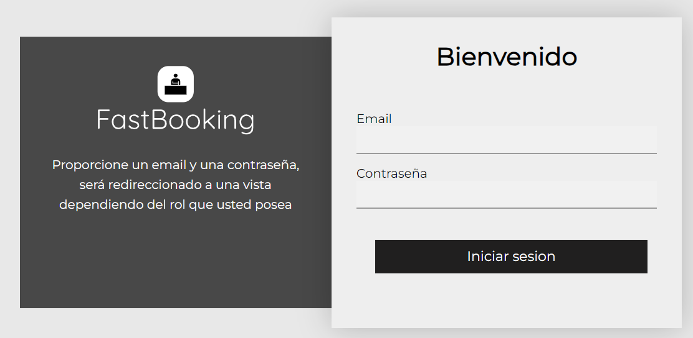
    
    El usuario final estaría destinado para el gerente y los recepcionistas del hotel, por lo tanto, se optó por la creación de dos vistas de dashboard, una para gerente:

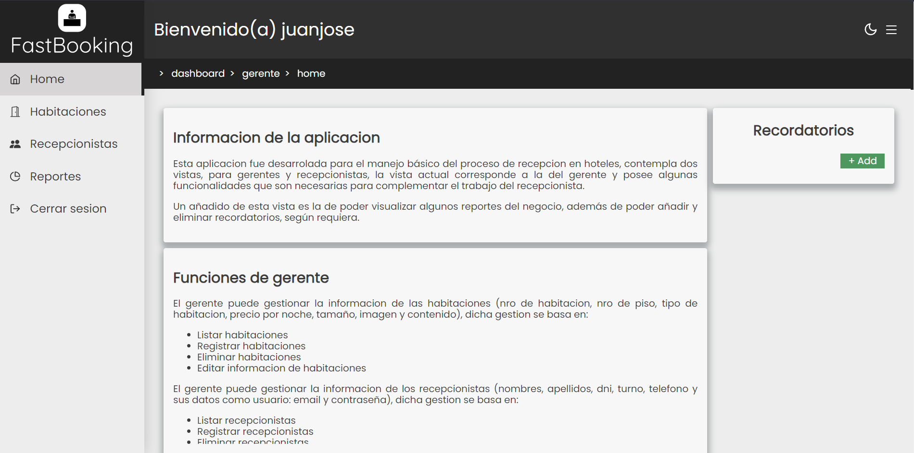

    Y otra para el recepcionista:

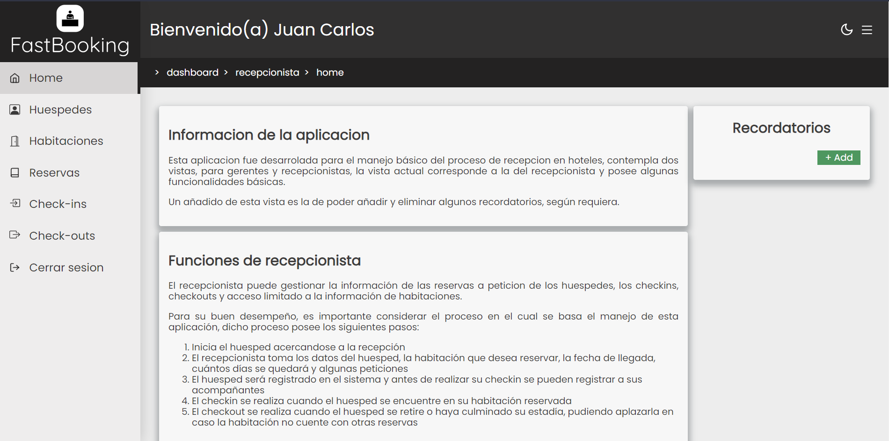

    Ambas vistas cuentan con el cambio de tema a oscuro, contracción de sidebar y generación de recordatorios.

### Funcionalidad para gerente

#### Habitaciones
    El gerente tiene la potestad de generar habitacioens y los recepcionistas que pertenecerán a su hotel:

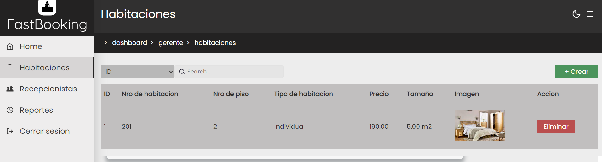

    Como se logra observar, se pueden generar, eliminar y también buscar habitaciones según un campo especificado en el header de la tabla

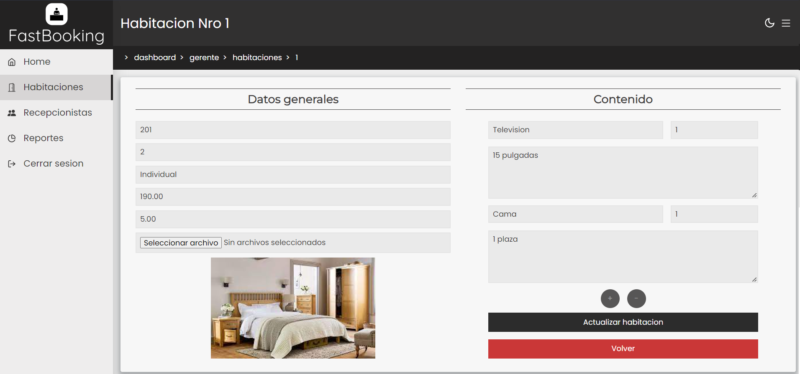

    Esta es la visualización de una habitación en específico, se pueden editar los campos y el contenido, la misma plantilla sirve para generar más habitaciones.

#### Recepcionistas

    Lo más importante para el gerente es la generación de recepcionistas para su hotel, estos se contemplan en la siguiente vista:

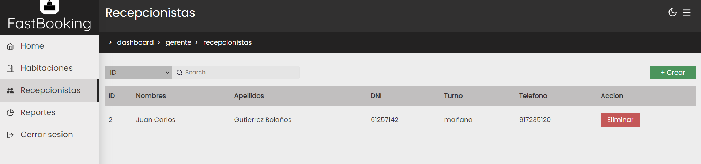

    Se pueden generar y eliminar, también buscar por campo

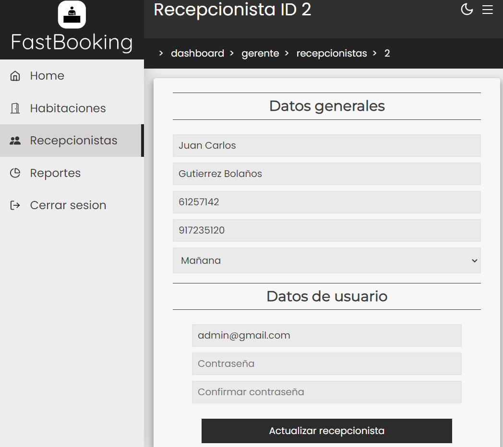

    Esta vista sirve para la modificación de datos, también para el registro de recepcionistas.

#### Reportes

    En esta sección se muestran algunos datos puntuales, como por ejemplo el número de recepcionistas actuales, reservas, habitaciones, checkins por habitación, huespedes por nacionalidad y ventas semanales, para el ejemplo se realizó una reserva y el checkout correspondiente, por lo cual, una habitación posee un checkin y un huesped fue registrado.

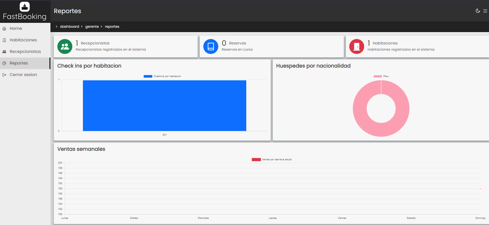

### Funcionalidad para recepcionistas

#### Huespedes:

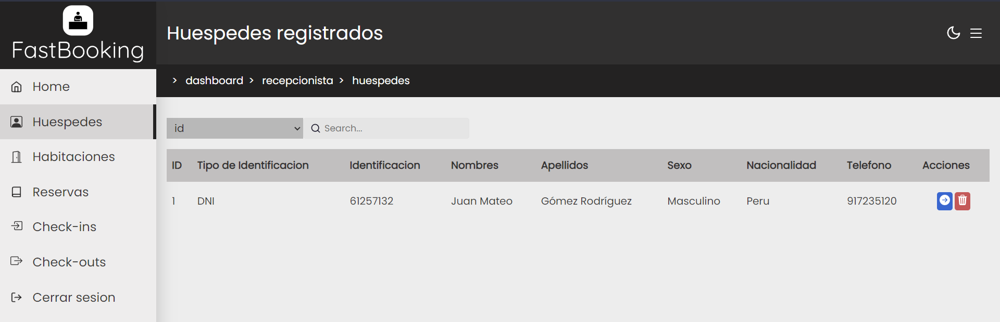

    Como en el ejemplo anterior, se encuentra un huesped registrado y cada fila de registro posee 3 funciones: eliminar, editar y generar reserva, un huesped que se encuentra ya registrado puede generar otra reserva si esque desea volver al hotel, dicha vista se mostrará más adelante.

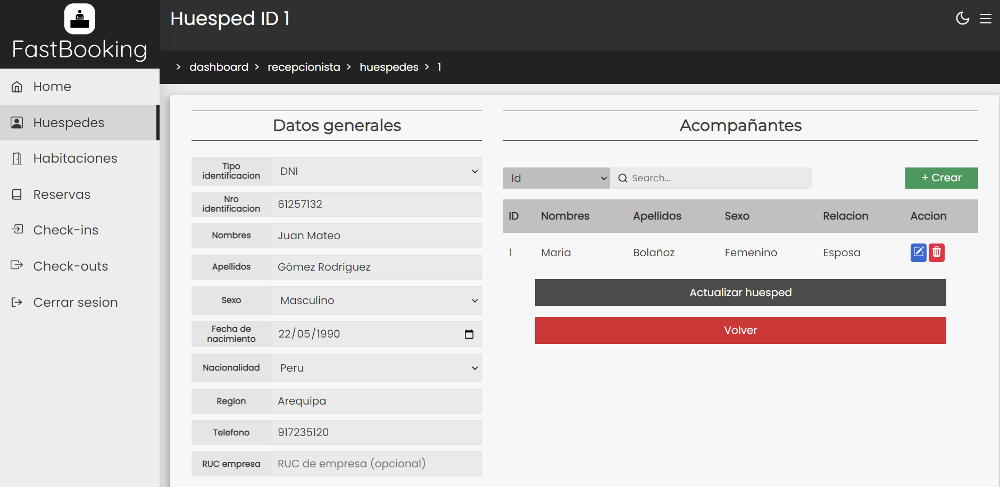

    En esta vista se pueden editar los campos del huesped registrado, además de registrar a sus acompañantes (esto solo es posible antes de realizar su checkin).

#### Habitaciones:

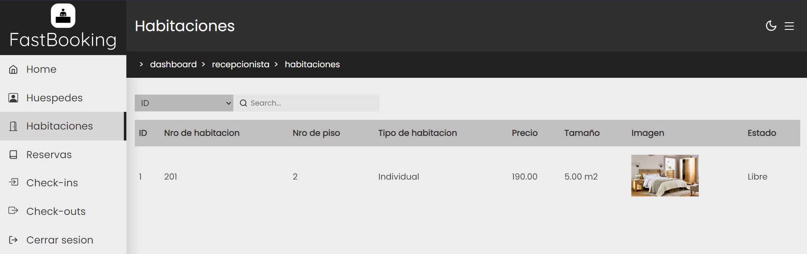

    La vista de habitaciones para recepcionista solo le permite visualizar el listado y poder modificar el estado en el que se encuentran.

#### Reservas:


    La vista de reservas le permite a lrecepcionista visualizar un listado, genear, editar, cancelar, eliminar y hacer un checkin de reservas.

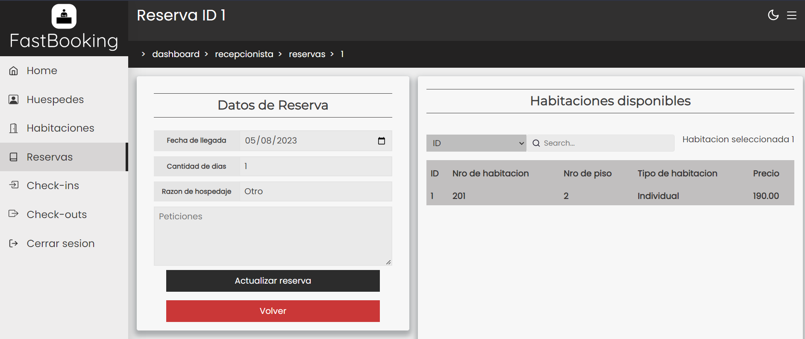

    En esta sección se puede editar la reserva seleccionada, la fecha de llegada, cantidad de días que se quedará el huesped, sus peticiones y la habitación a reservar.

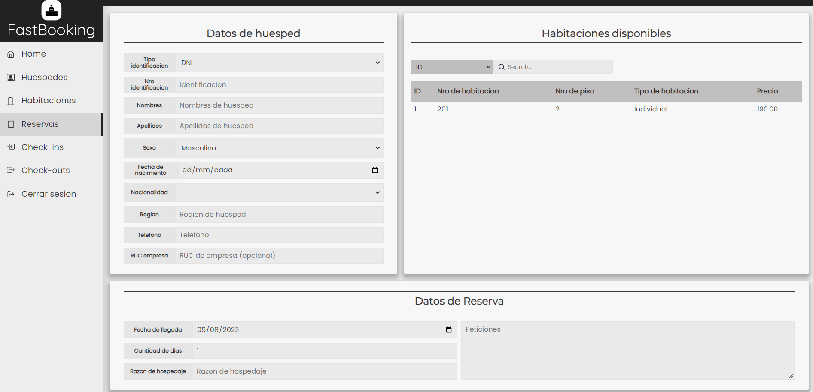

    Cuando se genera una reserva se deben ingresar los datos del tituloar (huesped), además de los datos mostrados en la anterior sección, cabe decir que en el listado de huéspedes también se puede llegar a esta vista, rellenando automaticamente los datos del huesped.

#### Checkins:

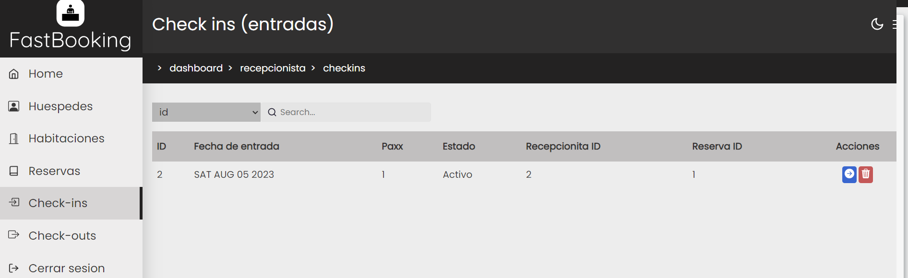

    La sección de checkins se muestra a manera de listado, pudiendo eliminarlos (en cuyo caso volvería al estado de reserva) o generar un checkout

#### Checkouts:

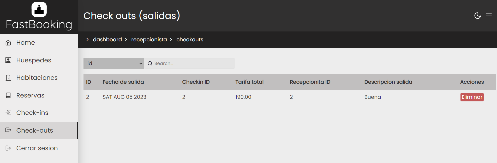

    En la sección de checkouts se muestra solo un listado de registros, aquí aparece la tarifa que se tiene que cobrar por hospedaje y la descripción de salida; si se borra, el checkin al cual pertenece volverá a tener un estado activo 

#### Recordatorios:

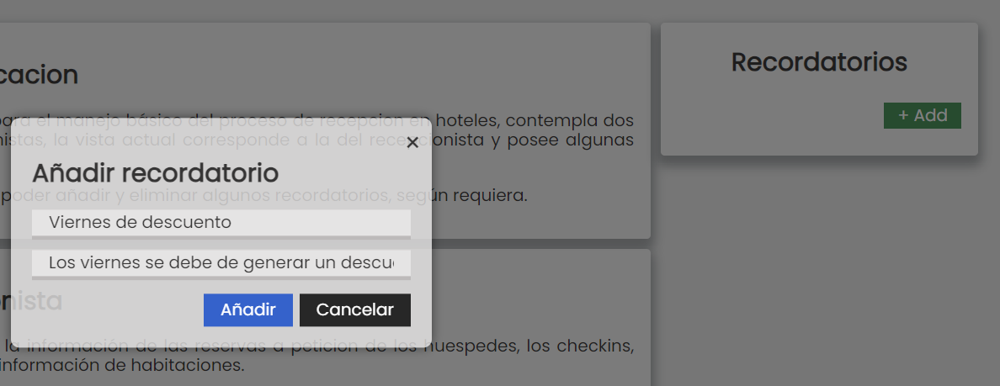

    La funcionalidad de recordatorios puede ser utilizada tanto por el gerente como el recepcionista, ambos generan un recordatorio en caso requieran.

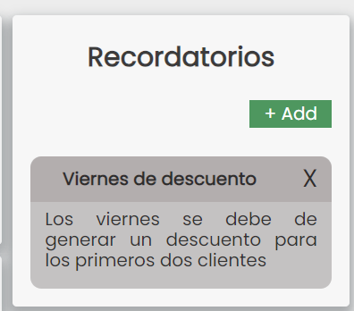

### Estructura de FrontEnd:

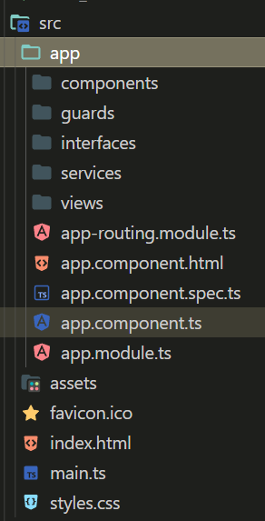

    El proyecto de angular consta de componentes (porciones de código HTML con independencia), guards (guardias para el bloqueo de acceso a rutas de dashboard, por autenticación y por rol), interfaces (tipo clases, permiten el modelado y estructuración de un tipo de dato, tanto para enviar como para recibir las respuestas de las apis), servicios (bloques de funcionalidad injectables a tantos componentes como se requiera, poseen la comunicación con el backend) y views, siendo estas últimas las vistas principales del proyecto, por si solas implican un bloque significativo y pueden contener más de un componente

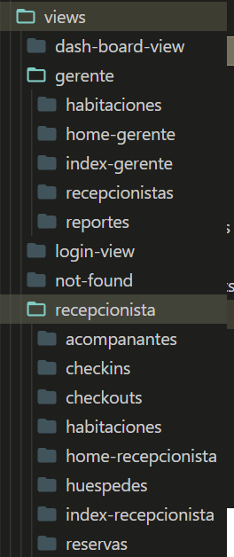

    Esta estructura corresponde a las vistas, debido a que algunas rutas son anidadas, como por ejemplo: 'dashboard/gerente' - 'dashboard/recepcionista', es necesario el uso de routes a manera de componentes, estos actúan como punto de articulación para el redireccionamiento a distintas vistas, un ejemplo de ello es 'dash-board-view'

### Comunicación con backend:

    La comunicación se logra mediante las peticiones a las apis del backend, gracias a la librerías HttpClient de Angular, mediante esta clase se crea un observable, a partir del cual se envía la petición y se espera la respuesta, por ejemplo:

```
export class LoginService extends ApiService{

  private apiUrl : string = `${this.HOST_API}${this.API_AUTH}`;
  private apiUrlLogout : string = `${this.HOST_API}${this.API_BACK}auth/`;


  login(user : User) {
    return this.httpClient.post(`${this.apiUrl}`, user)
  }

  logout() {
    return this.httpClient.post(this.apiUrlLogout, null, { headers: this.getHeaders() })
  }

}
```

    Este servicio de login hereda de una super clase ApiService, en esta misma se encuentra la url del backend y los headers de autenticación:

```
export abstract class ApiService { // Servicio global para apis

   HOST_API: string = 'http://localhost:8000'
   API_AUTH: string = '/api-token-auth/'
   API_BACK: string = '/api/v1/'

  protected HEADER: HttpHeaders = new HttpHeaders();

  constructor(protected httpClient : HttpClient, private storage : StorageInfoService) { }

  getHeaders() : HttpHeaders {
    return this.HEADER.append('Authorization', `Token ${this.storage.getKeyToken()}`);
  }

}
```

    Estas clases pueden ser instanciadas a manera de atributo en los componentes y llamar a sus métodos para la comunicación con las apis, ejemplo:

```
  constructor(private service : LoginService, private storage : StorageInfoService, private route : Router ) { }

  login() {
    if (!this.formData.invalid) {

      this.error = '';
      this.errorEmail = false;
      this.errorPassword= false;

      this.service.login(this.formData.value as User).subscribe({
        next: ((res : any) => { // Response ok
          this.storage.setInfo(res);
          this.route.navigate([`dashboard/${this.storage.getRol()}/`]); // Redireccion a ruta segun rol
        }),
        error: (err : any) => { // Error
          // Mensajes de error en vista
          this.error = 'Credenciales incorrectas';
          this.errorEmail = true;
          this.errorPassword= true;
         }
      });
    }
  }
```


##  CRUD - Core Business - Clientes finales
    El núcleo de la aplicación redica en el manejo del proceso de recepción, el cliente final es el usuario (gerente y recepcionista) del hotel, el proceso básico de recepción cosnta de:

    1. El recepcionista inicia sesión en la aplicación.
    2. El cliente llega al hotel y pide una reserva.
    3. El recepcionista registra los datos del huesped y de su reserva, visualiza las habitaciones disponibles.
    4. Se genera la reserva y antes de realizar el checkin, se deben de registrar los acompañantes.
    5. Una vez generados los acompañantes y el huesped haya llegado para su hospedaje, se realiza el checkin.
    6. Pasado el tiempo de estadía, el huesped se retira, a esto último se le conoce como checkout.

    La estructura de las plantillas para el front end de la aplicación se explicó anteriormente, así como la creación de los modelos.

##  Servicios mediante una API RESTful
    
    Se créo un servicio API RESTful para el manejo de la información del hotel, este consta de varias apis, en cada una es necesario el manejo de por lo menos un modelo y un serializer, este último sirve para comprimir la información de un objeto obtenido de la base de datos a texto el cual pueda interpretar el navegador.

### Serializers:

    Fue creado un serializer por cada modelo, en él se incluyen los campos a serializar, aquellos de lectura y el modelo:

#### User Serializer:

```
class UserSerializer(serializers.ModelSerializer):
    class Meta:
        model = User
        fields = ('id', 'nombres', 'apellidos',  'dni', 'telefono', 'turno', 'email')
        read_only_fields = ['rol', 'created_at', 'updated_at']

    def create_user(self, validated_data):
        User.objects.create_user(**validated_data)

    def update_user_password(self, validated_data, id):
        if 'password' in validated_data:
            user = User.objects.get(pk=id)
            user.set_password(validated_data['password'])
            user.save()
```

#### Habitación Serializer:

```
class HabitacionSerializer(serializers.ModelSerializer):
    class Meta:
        model = Habitacion
        fields = ('id', 'nro_habitacion', 'nro_piso', 'tipo_habitacion', 'precio', 'estado', 'tamanio', 'imagen')
        read_only_fields = ['created_at', 'updated_at']
```

#### Contenido Serializer:

```
class ContenidoSerializer(serializers.ModelSerializer):
    class Meta:
        model = Contenido
        fields = ('id', 'habitacion_id', 'nombre', 'cantidad', 'descripcion')
        read_only_fields = ['created_at', 'updated_at']
```

#### Huesped Serializer:

```
class HuespedSerializer(serializers.ModelSerializer):
    class Meta:
        model = Huesped
        fields = ('id', 'tipo_identificacion', 'identificacion', 'nombres', 'apellidos', 'sexo', 'fecha_nacimiento', 'nacionalidad', 'region', 'telefono', 'ruc_empresa')
        read_only_fields = ['created_at', 'updated_at']
```

#### Acompanante Serializer:

```
class AcompananteSerializer(serializers.ModelSerializer):
    class Meta:
        model = Acompanante
        fields = ('id', 'titular_id', 'nombres', 'apellidos', 'sexo', 'tipo_identificacion', 'identificacion', 'relacion')
        read_only_fields = ['created_at', 'updated_at']
```

#### Reserva Serializer:

```
class ReservaSerializer(serializers.ModelSerializer):
    class Meta:
        model = Reserva
        fields = ('id', 'recepcionista_id', 'titular_id', 'cantidad_dias', 'tipo_reserva', 'razon_hospedaje', 'fecha_llegada', 'peticiones', 'estado', 'habitacion_id')
        read_only_fields = ['created_at', 'updated_at']
```

#### Checkin Serializer:

```
class CheckinSerializer(serializers.ModelSerializer):
    class Meta:
        model = Checkin
        fields = ('id', 'recepcionista_id', 'reserva_id', 'fecha_entrada', 'estado', 'paxx')
        read_only_fields = ['created_at', 'updated_at']
```

#### Checkout Serializer:

```
class CheckoutSerializer(serializers.ModelSerializer):
    class Meta:
        model = Checkout
        fields = ('id', 'recepcionista_id', 'checkin_id', 'fecha_salida', 'descripcion_salida', 'tarifa')
        read_only_fields = ['created_at', 'updated_at']
```

#### Remind Serializer:

```
class RemindSerializer(serializers.ModelSerializer):
    class Meta:
        model = Remind
        fields = ('id', 'usuario_id', 'titulo', 'descripcion')
        read_only_fields = ['created_at', 'updated_at']
```

### ApiViews

    Las Api Views son clase que contienen las funciones de api (GET, POST, DELETE, PUT, PATCH), ya sea la petición que se haga a la url registrada se tomará un método u otro, la estructura que toman estas clases es la siguiente:

```
class <Model>ApiView(APIView):
    permission_classes = [permissions.IsAuthenticated] // Acceso a usuarios autenticados
    authentication_classes = [TokenAuthentication] // Autenticacion por token

    def get(self, request, id=None, *args, **kargs):
        pass

    def post(self, request, *args, **kargs):
        pass

    def delete(self, request, id, *args, **kargs):
        pass

    def put(self, request, id, *args, **kargs):
        pass

    def patch(self, request, id, *args, **kargs):
        pass
``` 


## Conclusión y trabajo futuro

    Esta aplicación fue pensada para el manejo básico del proceso de recepción de un hotel, por tal motivo no cuenta con una implementación completa o a gran escala de lo que contempla una empresa de este calibre, por lo tanto, la gran desventaja de este proyecto es el bajo panorama de validación, recolección de datos, comunicación en tiempo real, optimización de paquetes, código y alcance en cuanto a la utilidad de algunos campos de los modelos, como por ejemplo el email o telefono.

    Como trabajo futuro para esta aplicación se desea lo siguiente:

- Manejo de comunicación en tiempo real mediante websockets para la emisión de comunicados.
- Envío de correos a recepcionistas y clientes.
- Integración con whatsapp para uso de telefono.
- Validaciones más complejas y eficientes en cuanto al proceso de reservas.
- Optimización en la recolección de datos de huespedes.
- Integración con una aplicación móvil para las reservas virtuales y mediante cuentas de huespedes.
- Gestión de reportes más completa e informes semanales.
- Manejo de servicios adicionales y valor agregado.
- Pasarela de pagos real y facturación.


Github del proyecto:

Front End: https://github.com/JJCondoriPinto/UnsaProjectHotelier_Front.git

Back End: https://github.com/JJCondoriPinto/UnsaProjectHotelier_Back.git

Link de proyecto FrontEnd desplegado en coolify:

- https://fastbooking.bjrcode.com/

(Backend en proceso)

PlayList: https://www.youtube.com/playlist?list=PLgexcj5VtSG8qXptL0nDbwRmez3aBAYwi

## REFERENCIAS

-   https://www.djangoproject.com/
-   https://angular.io/
-   https://coolify.io/

#

[license]: https://img.shields.io/github/license/rescobedoq/pw2?label=rescobedoq
[license-file]: https://github.com/rescobedoq/pw2/blob/main/LICENSE

[downloads]: https://img.shields.io/github/downloads/rescobedoq/pw2/total?label=Downloads
[releases]: https://github.com/rescobedoq/pw2/releases/

[last-commit]: https://img.shields.io/github/last-commit/rescobedoq/pw2?label=Last%20Commit

[Debian]: https://img.shields.io/badge/Debian-D70A53?style=for-the-badge&logo=debian&logoColor=white
[debian-site]: https://www.debian.org/index.es.html

[Git]: https://img.shields.io/badge/git-%23F05033.svg?style=for-the-badge&logo=git&logoColor=white
[git-site]: https://git-scm.com/

[GitHub]: https://img.shields.io/badge/github-%23121011.svg?style=for-the-badge&logo=github&logoColor=white
[github-site]: https://github.com/

[Vim]: https://img.shields.io/badge/VIM-%2311AB00.svg?style=for-the-badge&logo=vim&logoColor=white
[vim-site]: https://www.vim.org/

[Java]: https://img.shields.io/badge/java-%23ED8B00.svg?style=for-the-badge&logo=java&logoColor=white
[java-site]: https://docs.oracle.com/javase/tutorial/


[![Debian][Debian]][debian-site]
[![Git][Git]][git-site]
[![GitHub][GitHub]][github-site]
[![Vim][Vim]][vim-site]
[![Java][Java]][java-site]


[![License][license]][license-file]
[![Downloads][downloads]][releases]
[![Last Commit][last-commit]][releases]